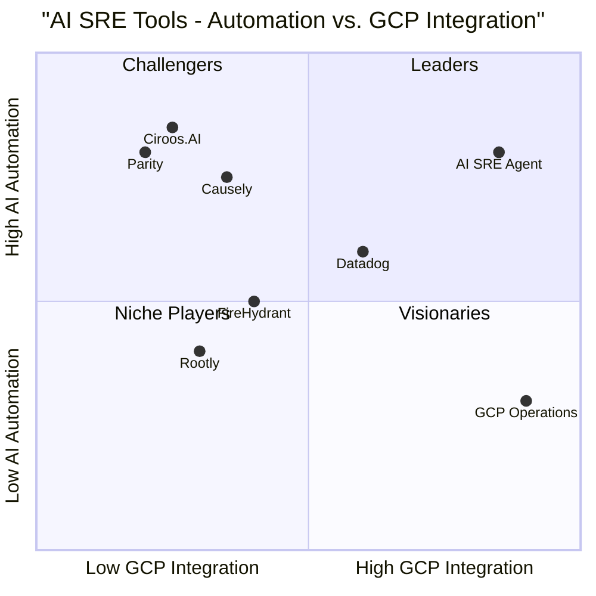

# AI SRE Agent Product Demo - Product Requirements Document

## 1. Language & Project Information

**Language**: English  
**Programming Language**: Python (backend), TypeScript/React (frontend), GCP services  
**Project Name**: GenAI_CE_AI_SRE1  
**Document Version**: 1.0  
**Date**: 2025-07-06  

### Original Requirements
Create a Product Demo of AI SRE Agent featuring 2 debugging scenarios with synthetic data to demonstrate automated root cause analysis of production issues using AI, observability data, playbooks, and incident history.

## 2. Product Definition

### 2.1 Product Goals

1. **Accelerate Incident Resolution**: Reduce Mean Time To Resolution (MTTR) from 30 minutes to under 5 minutes through AI-powered root cause analysis
2. **Automate SRE Workflows**: Enable 80% of common production incidents to be diagnosed and resolved without human intervention
3. **Enhance Observability Intelligence**: Transform raw GCP monitoring data into actionable insights through AI-driven correlation and pattern recognition

### 2.2 User Journeys

#### Journey 1: Incident Detection and Automated Diagnosis
1. **Alert Trigger**: Production monitoring system detects anomaly (e.g., latency spike)
2. **Agent Activation**: AI SRE Agent receives alert via chat interface or monitoring webhook
3. **Historical Analysis**: Agent searches past incidents database for similar symptoms
4. **Verification**: Agent validates hypothesis by querying GCP observability tools
5. **Resolution**: Agent provides root cause analysis with confidence score and remediation steps
6. **Human Approval**: SRE engineer approves or modifies recommended actions
7. **Resolution Tracking**: Agent monitors resolution effectiveness and updates incident database

#### Journey 2: Playbook-Driven Troubleshooting
1. **Symptom Input**: Engineer reports specific issue symptoms via chat
2. **Playbook Selection**: Agent identifies relevant troubleshooting playbook
3. **Step Execution**: Agent systematically executes playbook steps
4. **Dynamic Adaptation**: Agent adapts based on findings and escalates when needed
5. **Root Cause Identification**: Agent determines underlying cause with supporting evidence
6. **Action Recommendation**: Agent provides specific remediation steps
7. **Follow-up**: Agent tracks resolution and updates playbook effectiveness

### 2.3 User Stories

#### Core User Stories (P0 - Must Have)

**US001**: As an SRE Engineer, I want the AI agent to automatically detect and correlate production incidents with historical data so that I can quickly identify patterns and reduce investigation time.

**US002**: As an SRE Engineer, I want the AI agent to execute predefined playbooks systematically so that I can ensure consistent troubleshooting approaches across the team.

**US003**: As an SRE Engineer, I want the AI agent to provide real-time analysis of GCP monitoring metrics so that I can understand system health without manually querying multiple dashboards.

**US004**: As an SRE Engineer, I want the AI agent to generate confidence scores for its diagnoses so that I can make informed decisions about automated vs. manual interventions.

**US005**: As an SRE Engineer, I want the AI agent to provide a clear reasoning trail for its analysis so that I can understand and validate its conclusions.

#### Enhanced User Stories (P1 - Should Have)

**US006**: As an SRE Engineer, I want the AI agent to automatically create incident timelines with relevant log snippets and metrics so that I can quickly understand the sequence of events.

**US007**: As an SRE Engineer, I want the AI agent to suggest infrastructure scaling actions based on resource utilization patterns so that I can proactively prevent capacity issues.

**US008**: As an SRE Engineer, I want the AI agent to integrate with GCP Error Reporting to identify recurring error patterns so that I can prioritize fixes for high-impact issues.

**US009**: As an SRE Engineer, I want the AI agent to provide post-incident analysis and playbook updates so that our troubleshooting procedures continuously improve.

#### Advanced User Stories (P2 - Nice to Have)

**US010**: As an SRE Manager, I want the AI agent to generate weekly incident trend reports so that I can identify systemic issues and resource needs.

**US011**: As an SRE Engineer, I want the AI agent to predict potential failures based on anomaly patterns so that I can implement preventive measures.

**US012**: As an SRE Engineer, I want the AI agent to automatically update infrastructure blueprints based on discovered dependencies so that our system documentation stays current.

### 2.4 Competitive Analysis

#### Direct Competitors

**Rootly** - Incident management platform with Slack integration
- Strengths: Strong workflow automation, excellent team collaboration features
- Weaknesses: Limited AI-powered root cause analysis, requires manual playbook creation
- Market Position: Established player with strong developer adoption

**Parity** - AI SRE for incident response
- Strengths: AI-first approach, reduces response times significantly
- Weaknesses: Less mature platform, limited GCP-specific integrations
- Market Position: Emerging player with focus on AI automation

**Ciroos.AI** - AI agents for proactive anomaly investigation
- Strengths: Proactive approach, up to 90% reduction in response times
- Weaknesses: Newer platform, limited proven track record
- Market Position: Well-funded startup with advanced AI capabilities

**Causely** - Causal modeling for root cause analysis
- Strengths: Advanced causal inference, precise root cause identification
- Weaknesses: Complex setup, requires significant observability maturity
- Market Position: Specialized tool for advanced SRE teams

**FireHydrant** - Incident management with AI-driven automation
- Strengths: Comprehensive incident lifecycle management
- Weaknesses: Limited playbook automation, manual correlation required
- Market Position: Mid-market leader with broad feature set

#### Indirect Competitors

**Google Cloud Operations Suite** - Native GCP observability
- Strengths: Deep GCP integration, comprehensive monitoring and logging
- Weaknesses: Limited AI-powered analysis, requires manual correlation
- Market Position: Default choice for GCP customers

**Datadog** - Observability platform with AI features
- Strengths: Broad platform coverage, growing AI capabilities
- Weaknesses: Generic approach, not SRE-specific
- Market Position: Market leader in observability

### 2.5 Competitive Quadrant Chart



## 3. Technical Specifications

### 3.1 Requirements Analysis

#### Data Requirements
- **Incident Database**: Historical incidents stored in AlloyDB with vector embeddings for similarity search
- **Playbook Repository**: JSON-structured troubleshooting workflows with versioning and effectiveness tracking
- **Infrastructure Blueprint**: Terraform-like configuration files defining system dependencies and resource relationships
- **Observability Data**: Real-time metrics, logs, traces, and error reports from GCP services
- **Authentication Data**: Service account credentials and IAM role definitions for secure API access

#### External Integrations
- **GCP Monitoring API**: Fetch metrics for CPU, memory, latency, and custom application metrics
- **GCP Logging API**: Search and analyze application and system logs with advanced filtering
- **GCP Error Reporting API**: Identify and categorize recurring errors with frequency analysis
- **GCP Tracing API**: Analyze distributed request flows and identify performance bottlenecks
- **AlloyDB**: Store and query incident history with vector similarity search capabilities
- **Chat Interface**: Slack/Teams integration for real-time communication and command execution

#### Performance Requirements
- **Response Time**: Initial incident analysis must complete within 30 seconds
- **Scalability**: Support concurrent analysis of up to 100 incidents
- **Availability**: 99.9% uptime with automatic failover capabilities
- **Data Freshness**: Observability data must be no more than 1 minute old

#### Security Requirements
- **Authentication**: GCP Service Account-based authentication with least-privilege IAM roles
- **Data Protection**: All sensitive data encrypted at rest and in transit
- **Audit Logging**: Complete audit trail of all agent actions and decisions
- **Access Control**: Role-based access control for different user types (SRE, Manager, Read-only)

### 3.2 Requirements Pool

#### P0 Requirements (Must Have)

**REQ001**: The system MUST integrate with all four GCP observability tools (Monitoring, Logging, Error Reporting, Tracing) with read-only access by default.

**REQ002**: The system MUST implement vector similarity search to correlate current incidents with historical data, achieving >85% relevance in matches.

**REQ003**: The system MUST execute playbook steps systematically and provide confidence scores for each diagnosis.

**REQ004**: The system MUST provide a real-time chat interface with emoji indicators and clickable links to GCP dashboards.

**REQ005**: The system MUST implement safety guardrails preventing automated remediation without human approval.

#### P1 Requirements (Should Have)

**REQ006**: The system SHOULD generate automated incident timelines with relevant log snippets and metric correlations.

**REQ007**: The system SHOULD provide post-incident analysis to update playbook effectiveness scores.

**REQ008**: The system SHOULD implement caching for frequently accessed GCP monitoring data to improve response times.

**REQ009**: The system SHOULD support custom playbook creation through a structured JSON interface.

#### P2 Requirements (Nice to Have)

**REQ010**: The system MAY implement predictive analytics to identify potential issues before they impact users.

**REQ011**: The system MAY generate weekly trend reports showing incident patterns and resolution effectiveness.

**REQ012**: The system MAY automatically update infrastructure blueprints based on discovered dependencies.

### 3.3 UI Design Draft

#### Chat Interface Layout
```
┌─────────────────────────────────────────────────────────────┐
│ AI SRE Agent - Production Incident Analysis                 │
├─────────────────────────────────────────────────────────────┤
│ 🔍 Incident #2024-001: Payment API Latency Spike           │
│ Status: Investigating | Confidence: 85% | Time: 2m 30s     │
├─────────────────────────────────────────────────────────────┤
│ Agent: ⚠️ Detected latency spike in US region...           │
│ Agent: 📚 Checking past incidents: Found 2 matches         │
│ Agent: 🔗 [GCP Monitoring Query]                           │
│ Agent: ✅ Root cause: Redis cache misses                   │
│ Agent: 💡 Fix: Warm cache + scale Redis nodes             │
│ Agent: ⚠️ Action Required: Confirm execution               │
├─────────────────────────────────────────────────────────────┤
│ Your Input: [Type @sre-bot to start new analysis]          │
└─────────────────────────────────────────────────────────────┘
```

#### Dashboard Components
- **Incident Status Panel**: Real-time status of active investigations
- **Confidence Meter**: Visual indicator of diagnosis confidence
- **Timeline View**: Chronological sequence of analysis steps
- **Evidence Panel**: Links to relevant GCP dashboards and log snippets
- **Action Items**: Clear remediation steps with approval buttons

### 3.4 System Constraints

#### Technical Constraints
- **Platform**: Must run on Google Cloud Platform with Kubernetes deployment
- **Languages**: Python for backend AI logic, TypeScript/React for frontend interface
- **Database**: AlloyDB for incident storage, Cloud SQL for configuration data
- **Authentication**: Must use GCP Service Accounts only, no external auth systems
- **API Limits**: Must respect GCP API rate limits and implement appropriate retry logic

#### Business Constraints
- **Budget**: Development and deployment costs must stay within allocated GCP credits
- **Timeline**: Demo must be ready within 8 weeks from project start
- **Compliance**: Must meet enterprise security and privacy requirements
- **Scalability**: Must handle production workloads for customers with 1000+ services

#### Environmental Constraints
- **Network**: Must function in restricted network environments with firewall rules
- **Latency**: Must work effectively with GCP regions worldwide
- **Availability**: Must handle GCP service outages gracefully

### 3.5 Open Questions

1. **Playbook Versioning**: How should we handle versioning and rollback of playbooks when effectiveness scores change?

2. **Multi-Region Deployment**: What's the strategy for handling incidents that span multiple GCP regions?

3. **Custom Metrics**: How should customers define and integrate their own application-specific metrics?

4. **Incident Prioritization**: What algorithm should we use to prioritize multiple concurrent incidents?

5. **Learning Rate**: How frequently should the AI model retrain on new incident data?

6. **False Positive Handling**: What's the acceptable false positive rate for automated diagnoses?

7. **Integration Depth**: Should we integrate with customer's existing incident management tools (Jira, ServiceNow)?

8. **Data Retention**: How long should we retain historical incident data for analysis?

## 4. Demo Scenarios with Synthetic Data

### 4.1 Scenario 1: Past Incident Correlation & Diagnosis

#### Scenario Setup
**Incident Type**: Payment API Latency Spike  
**Trigger**: Automated alert from GCP Monitoring  
**Synthetic Environment**: E-commerce platform with microservices architecture  

#### Synthetic Data Components

**Infrastructure Blueprint**:
```json
{
  "services": {
    "payment-api": {
      "type": "Cloud Run",
      "dependencies": ["redis-cache", "payment-db", "fraud-service"],
      "region": "us-central1"
    },
    "redis-cache": {
      "type": "Memorystore",
      "instance": "redis-prod-001",
      "region": "us-central1"
    },
    "payment-db": {
      "type": "Cloud SQL",
      "instance": "payments-prod",
      "region": "us-central1"
    }
  }
}
```

**Historical Incidents Database**:
```json
[
  {
    "incident_id": "INC-2024-045",
    "timestamp": "2024-06-15T14:30:00Z",
    "symptoms": "Payment API latency > 5s, Redis cache hit rate 35%",
    "root_cause": "Redis memory eviction due to insufficient capacity",
    "resolution": "Scaled Redis nodes from 2 to 4, cache hit rate restored to 95%",
    "resolution_time": "25 minutes",
    "confidence": 0.92
  },
  {
    "incident_id": "INC-2024-072",
    "timestamp": "2024-06-28T09:15:00Z",
    "symptoms": "Payment API latency > 3s, Database connection pool exhausted",
    "root_cause": "Database connection leak in payment processing service",
    "resolution": "Restarted service instances, fixed connection pooling bug",
    "resolution_time": "18 minutes",
    "confidence": 0.88
  }
]
```

**Current Incident Synthetic Data**:
```json
{
  "alert_timestamp": "2024-07-06T16:45:00Z",
  "metrics": {
    "payment_api_latency_p95": 6.2,
    "redis_cache_hit_rate": 38,
    "database_connection_pool_utilization": 65,
    "error_rate": 0.02
  },
  "logs": [
    {
      "timestamp": "2024-07-06T16:44:55Z",
      "level": "WARN",
      "service": "payment-api",
      "message": "Cache miss for user_profile_12345, falling back to database"
    },
    {
      "timestamp": "2024-07-06T16:45:02Z",
      "level": "ERROR",
      "service": "payment-api",
      "message": "Database query timeout after 5000ms for user_profile_lookup"
    }
  ]
}
```

#### Expected Demo Flow

1. **Alert Reception**:
   ```
   Agent: ⚠️ Alert received: Payment API latency spike detected
   Agent: 📊 Current P95 latency: 6.2s (threshold: 2.0s)
   Agent: 🔍 Initiating investigation...
   ```

2. **Historical Analysis**:
   ```
   Agent: 📚 Searching incident history...
   Agent: ✅ Found 2 similar incidents (INC-2024-045, INC-2024-072)
   Agent: 🎯 Strongest match: INC-2024-045 (92% similarity)
   Agent: 📋 Testing hypothesis: Redis cache performance degradation
   ```

3. **Verification**:
   ```
   Agent: 🔗 Checking Redis cache metrics [GCP Monitoring Link]
   Agent: ⚠️ Cache hit rate: 38% (normal: >90%)
   Agent: ✅ Hypothesis confirmed: Cache performance issue
   ```

4. **Root Cause & Resolution**:
   ```
   Agent: 🎯 Root Cause: Redis memory eviction causing cache misses
   Agent: 💡 Recommended Fix: Scale Redis nodes (2 → 4 instances)
   Agent: ⏱️ Expected Resolution Time: 15 minutes
   Agent: 🔒 Confidence Score: 92%
   Agent: ⚠️ Action Required: Approve Redis scaling operation
   ```

### 4.2 Scenario 2: Playbook-Driven Debugging

#### Scenario Setup
**Incident Type**: Database Connection Pool Exhaustion  
**Trigger**: Manual report from SRE engineer  
**Synthetic Environment**: Multi-tenant SaaS application  

#### Synthetic Data Components

**Database Timeout Playbook**:
```json
{
  "playbook_id": "PB-DB-TIMEOUT-001",
  "name": "Database Connection Timeout Troubleshooting",
  "version": "1.2",
  "steps": [
    {
      "step_id": "1",
      "description": "Check database connection pool utilization",
      "query": "gcp_monitoring.query('cloudsql_database_connection_count')",
      "expected_threshold": "< 80%",
      "escalation_condition": "> 90%"
    },
    {
      "step_id": "2",
      "description": "Analyze connection timeout errors in logs",
      "query": "gcp_logging.search('connection_timeout OR connection_refused')",
      "time_range": "last_30_minutes"
    },
    {
      "step_id": "3",
      "description": "Check for long-running queries",
      "query": "gcp_monitoring.query('cloudsql_query_execution_time')",
      "expected_threshold": "< 5s"
    }
  ]
}
```

**Current Incident Synthetic Data**:
```json
{
  "user_report": "@sre-bot: Users reporting 'Database timeout' errors in billing service",
  "timestamp": "2024-07-06T11:20:00Z",
  "metrics": {
    "database_connection_pool_utilization": 95,
    "database_active_connections": 190,
    "database_max_connections": 200,
    "average_query_time": 8.5,
    "slow_query_count": 12
  },
  "logs": [
    {
      "timestamp": "2024-07-06T11:19:45Z",
      "level": "ERROR",
      "service": "billing-service",
      "message": "Connection timeout: Unable to acquire connection from pool within 5000ms"
    },
    {
      "timestamp": "2024-07-06T11:19:50Z",
      "level": "WARN",
      "service": "billing-service",
      "message": "Query execution time: 8.2s for invoice_calculation_bulk_update"
    }
  ],
  "slow_queries": [
    {
      "query": "UPDATE invoices SET status = 'processed' WHERE customer_id IN (...)",
      "execution_time": 12.3,
      "rows_affected": 50000
    }
  ]
}
```

#### Expected Demo Flow

1. **Incident Report**:
   ```
   User: @sre-bot: Users reporting 'Database timeout' errors in billing service
   Agent: 🔍 Received incident report. Analyzing symptoms...
   Agent: 📋 Symptoms detected: Database timeout, Billing service
   Agent: 📖 Selecting playbook: Database Connection Timeout Troubleshooting
   ```

2. **Playbook Execution - Step 1**:
   ```
   Agent: 📘 Executing Step 1: Check database connection pool utilization
   Agent: 🔗 [GCP Monitoring Query: Connection Pool Metrics]
   Agent: ⚠️ Result: Pool utilization at 95% (190/200 connections)
   Agent: 🚨 Threshold exceeded: > 90% (escalation condition met)
   ```

3. **Playbook Execution - Step 2**:
   ```
   Agent: 📘 Executing Step 2: Analyze connection timeout errors
   Agent: 🔍 Searching logs for connection timeout patterns...
   Agent: ⚠️ Found 15 timeout errors in last 30 minutes
   Agent: 📊 Error frequency: 0.5 errors/minute (increasing trend)
   ```

4. **Playbook Execution - Step 3**:
   ```
   Agent: 📘 Executing Step 3: Check for long-running queries
   Agent: 🔗 [GCP Monitoring Query: Query Execution Time]
   Agent: 🚨 Critical: Average query time 8.5s (threshold: < 5s)
   Agent: 🐌 Identified slow query: invoice_calculation_bulk_update (12.3s)
   ```

5. **Root Cause & Resolution**:
   ```
   Agent: 🎯 Root Cause Analysis Complete
   Agent: 📋 Issue: Long-running bulk update query monopolizing connections
   Agent: 💡 Recommended Actions:
   Agent:   1. Kill long-running query (PID: 12345)
   Agent:   2. Optimize bulk update to use batching (50k → 5k rows)
   Agent:   3. Increase connection pool size (200 → 300)
   Agent: ⏱️ Expected Resolution Time: 10 minutes
   Agent: 🔒 Confidence Score: 88%
   Agent: ⚠️ Action Required: Approve query termination and optimization
   ```

## 5. Success Metrics

### 5.1 Primary Metrics

**Mean Time To Resolution (MTTR)**:
- **Baseline**: 30 minutes (industry average)
- **Target**: < 5 minutes for 70% of incidents
- **Measurement**: Time from incident detection to resolution implementation

**Automated Resolution Rate**:
- **Baseline**: 0% (fully manual process)
- **Target**: 60% of incidents resolved without human intervention
- **Measurement**: Percentage of incidents resolved through automated actions

**Diagnosis Accuracy**:
- **Baseline**: N/A (new capability)
- **Target**: > 85% accuracy for root cause identification
- **Measurement**: Percentage of diagnoses confirmed correct by human validation

### 5.2 Secondary Metrics

**Playbook Coverage**:
- **Target**: 80% of incidents mapped to existing playbooks
- **Measurement**: Percentage of incidents that can be handled by available playbooks

**User Satisfaction Score**:
- **Target**: > 4.0/5.0 rating from SRE engineers
- **Measurement**: Monthly feedback surveys and chat interaction ratings

**System Performance**:
- **Target**: < 30 seconds for initial incident analysis
- **Measurement**: Response time from incident input to first analysis output

**Cost Reduction**:
- **Target**: 40% reduction in incident response costs
- **Measurement**: Calculated based on engineer time saved and downtime prevented

## 6. Implementation Roadmap

### Phase 1: Core Infrastructure (Weeks 1-3)
- Set up GCP project and service accounts
- Implement basic chat interface
- Build GCP observability tools integration
- Create incident database schema in AlloyDB

### Phase 2: AI Engine Development (Weeks 4-6)
- Implement vector similarity search for incident correlation
- Build playbook execution engine
- Develop confidence scoring algorithms
- Create synthetic data generators for testing

### Phase 3: Demo Preparation (Weeks 7-8)
- Develop two demo scenarios with synthetic data
- Create demo environment with realistic infrastructure
- Build demo presentation materials
- Conduct internal testing and refinement

### Phase 4: Customer Demo (Week 9)
- Conduct customer demonstrations
- Gather feedback and requirements
- Document lessons learned
- Plan production development roadmap

## 7. Risk Assessment

### High-Risk Items
- **AI Model Accuracy**: Risk of incorrect diagnoses leading to wrong actions
- **GCP API Limits**: Risk of hitting rate limits during high-incident periods
- **Data Quality**: Risk of poor synthetic data affecting demo effectiveness

### Medium-Risk Items
- **Performance**: Risk of slow response times during complex analyses
- **Integration Complexity**: Risk of GCP service integration issues
- **User Adoption**: Risk of resistance to AI-driven automation

### Low-Risk Items
- **Technology Stack**: Well-established tools and frameworks
- **Team Capability**: Strong technical expertise in required areas
- **Infrastructure**: Reliable GCP platform foundation

## 8. Conclusion

The AI SRE Agent represents a significant advancement in production incident management, combining AI-powered analysis with comprehensive GCP observability integration. The two demo scenarios will effectively demonstrate the system's capabilities in both historical incident correlation and playbook-driven debugging.

Key differentiators from competitive solutions include:
- Deep GCP integration with native observability tools
- AI-powered historical incident correlation
- Systematic playbook execution with dynamic adaptation
- Comprehensive reasoning trails with confidence scoring
- Safety-first approach with human-in-the-loop validation

The demo will showcase measurable value through reduced MTTR, increased automation rates, and improved incident resolution accuracy, positioning the AI SRE Agent as a compelling solution for enterprises seeking to modernize their production operations.